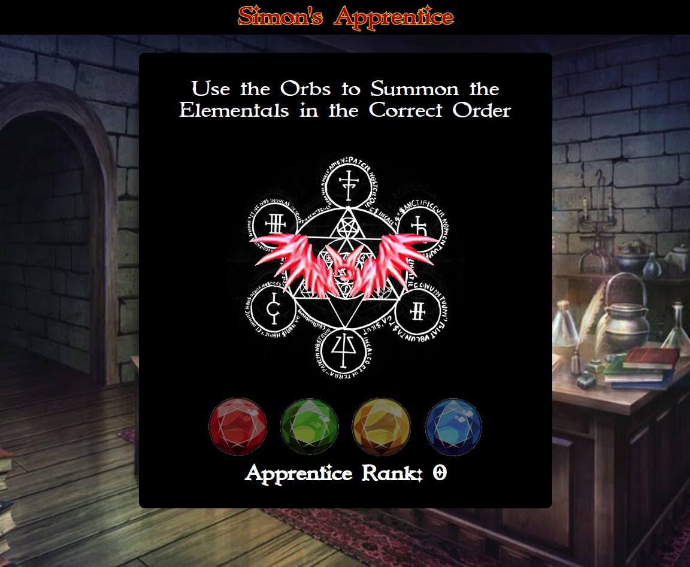

# Simon's Apprentice

## [Live Link](https://stickmanbob.github.io/Simons-Apprentice/#/)

## Description

*You are an aspiring magician, and are fortunate enough to have
recently been accepted as an apprentice by Simon, one of the 
greatest sorcerors alive today. In order to earn his favor, you 
must rise through the ranks of his other apprentices by successfully
casting spells. But beware, one wrong step and your spell will fizzle, 
and Simon does not tolerate failure* ...

Simon's Apprentice is a magic-themed take on the classic game "Simon". Each round,
Simon will demonstrate a spell by summon elementals in a particular sequence. You must use the four orbs
of power on the bottom of the screen to match his summoning sequence and successfully
cast the spell. Each round the sequence stays the same, but one more elemental is summoned.
How far can you make it before your spell fizzles?

This project was built in under 48 hours using React. All assets are borrowed from the web.
Care was taken to only use open source images, but if you see your image here and
would like to be credited or have the image removed please contact me. This project
is non-commercial.